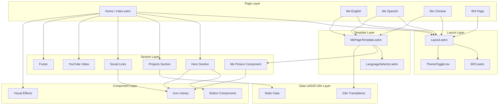

# Project Architecture

This document provides a comprehensive overview of the project's architecture, facilitating understanding and future development.

## Overview

**gohit.xyz** is a modern, multilingual portfolio website built with **Astro 5**, featuring internationalization (i18n), interactive components, custom theming, and SEO optimization. The project leverages Astro's server-side rendering capabilities, React for interactive elements, and Tailwind CSS v4 for modern styling.

## Technology Stack

- **Framework**: Astro 5.16.4
- **UI Libraries**: React 19.2.1 (for interactive components)
- **Styling**: Tailwind CSS 4.1.17 (via Vite plugin) + Custom CSS
- **Runtime**: Bun (development server and package manager)
- **Integrations**:
  - `@astrojs/react`: React component integration
- **Development Tools**:
  - Prettier 3.7.4 with Astro and Tailwind plugins
  - TypeScript for type safety

## Directory Structure

```
gohitx/
├── public/              # Static public assets
│   ├── cursors/         # Custom cursor files (.ico)
│   │   ├── Link.ico     # Cursor for link hover states
│   │   └── Pointer.ico  # Default cursor
│   ├── favicon.ico      # Site favicon
│   ├── robots.txt       # SEO crawler directives
│   └── sitemap.xml      # Generated sitemap
├── src/
│   ├── assets/          # Optimized assets (images, media)
│   ├── components/      # Reusable UI components
│   │   ├── SEO.astro                  # SEO meta tags and structured data
│   │   ├── ThemeToggle.tsx            # React theme switcher (dark/light)
│   │   ├── icons/                     # Icon library
│   │   │   ├── global/                # General purpose icons (13 icons)
│   │   │   ├── social-media/          # Social platform icons (9 icons)
│   │   │   └── icons.ts               # Icon barrel exports
│   │   ├── me/                        # "About Me" page components
│   │   │   ├── LanguageSelector.astro # i18n language switcher
│   │   │   ├── MePageTemplate.astro   # Reusable template for localized pages
│   │   │   ├── MePicture.astro        # Profile picture with social links
│   │   │   └── i18n/                  # Internationalization system
│   │   │       ├── en.ts              # English translations
│   │   │       ├── es.ts              # Spanish translations
│   │   │       ├── zh.ts              # Chinese translations
│   │   │       └── languages.ts       # Language type definitions
│   │   └── ui/                        # UI component library
│   │       ├── buttons/               # Interactive buttons (4 components)
│   │       │   ├── BackButtonOne.astro
│   │       │   ├── GithubStartBtn.astro
│   │       │   ├── NewBtn.astro
│   │       │   └── YoutubeBtn.astro
│   │       ├── effects/               # Visual effects
│   │       │   ├── GlowEffect.astro   # Dynamic glow background
│   │       │   └── decorative/        # Decorative effect components (7)
│   │       └── ui.ts                  # UI barrel exports
│   ├── config/          # Configuration files
│   │   └── seoConfig.ts # SEO configuration and constants
│   ├── data/            # Static TypeScript data
│   │   ├── extensions.ts # VSCode extensions showcase
│   │   └── youtube.ts    # YouTube channel data
│   ├── layouts/         # Page layout templates
│   │   └── Layout.astro  # Main layout with SEO, theme, and dark mode
│   ├── pages/           # File-based routing
│   │   ├── index.astro   # Home page (English)
│   │   ├── 404.astro     # Error page
│   │   └── me/           # About pages with i18n
│   │       ├── index.astro        # English about page
│   │       ├── es/                # Spanish locale
│   │       │   └── index.astro    # Spanish about page
│   │       └── zh/                # Chinese locale
│   │           └── index.astro    # Chinese about page
│   ├── sections/        # Major page sections
│   │   ├── home/        # Home page sections
│   │   │   ├── Hero.astro         # Hero section with profile
│   │   │   ├── Projects.astro     # Projects/extensions grid
│   │   │   ├── SocialLinks.astro  # Social media links with hover effects
│   │   │   └── YouTubeVideo.astro # Embedded YouTube video
│   │   ├── shared/
│   │   │   └── Footer.astro       # Shared footer component
│   │   └── sections.ts            # Section barrel exports
│   └── styles/
│       └── global.css   # Global styles, theme variables, dark mode
├── astro.config.mjs     # Astro configuration
├── package.json         # Project dependencies
├── tsconfig.json        # TypeScript configuration
└── ARCHITECTURE.md      # This file
```

## Component Architecture

### Component Hierarchy



### Key Component Details

#### Layout Components

**`Layout.astro`** - Main layout wrapper providing:

- Global styles and theme initialization
- SEO component integration
- Dark/light mode system preference detection
- Responsive container structure
- Theme persistence via localStorage

**`SEO.astro`** - Comprehensive SEO component:

- Dynamic meta tags (title, description)
- Open Graph protocol support
- Twitter Card metadata
- Structured data (JSON-LD) for rich results
- VSCode extension structured data
- Language and canonical URL support

**`ThemeToggle.tsx`** - React-based theme switcher:

- Toggle between dark and light modes
- Smooth transitions with Tailwind
- LocalStorage persistence
- System preference detection

#### Internationalization System

**`MePageTemplate.astro`** - Reusable i18n template:

- Accepts language parameter (`en`, `es`, `zh`)
- Loads appropriate translations
- Renders localized content
- Includes language selector

**`LanguageSelector.astro`** - Language switching UI:

- Visual language options
- Hover effects
- Redirects to localized routes

**Translation Files** (`src/components/me/i18n/`):

- Type-safe translation objects
- Structured content (title, description, sections)
- Consistent interface across languages

#### Section Components

**`Hero.astro`** - Home page hero section:

- Profile introduction
- Call-to-action buttons
- Animated entrance

**`SocialLinks.astro`** - Social media link grid:

- Dynamic hover effects with glow
- Color-coded platform links
- Responsive icon sizing
- Integrated with `GlowEffect`

**`Projects.astro`** - Project showcase:

- VSCode extension grid
- Dynamic data from `extensions.ts`
- Responsive card layout

**`YouTubeVideo.astro`** - Embedded video player:

- Responsive iframe
- Lazy loading
- Styled container

**`MePicture.astro`** - Profile picture component:

- Image display with hover effects
- Social icon overlays
- Smooth transitions

#### UI Components

**Buttons** (`src/components/ui/buttons/`):

- `BackButtonOne.astro`: Navigation back button
- `GithubStartBtn.astro`: GitHub star button with API integration
- `NewBtn.astro`: Customizable "NEW" badge button
- `YoutubeBtn.astro`: YouTube subscribe button

**Effects** (`src/components/ui/effects/`):

- `GlowEffect.astro`: Dynamic background glow that responds to social link hovers
- `decorative/`: Decorative visual effects (7 components)

**Icons** (`src/components/icons/`):

- **Global icons** (13): General UI icons
- **Social media icons** (9): YouTube, GitHub, LinkedIn, Instagram, TikTok, Twitter, etc.
- Consistent SVG-based components
- Accessible with proper labels

## Key Architectural Patterns

### 1. Internationalization (i18n)

**Approach**: File-based routing with shared templates

```
pages/me/
├── index.astro       # English (default)
├── es/
│   └── index.astro   # Spanish
└── zh/
    └── index.astro   # Chinese
```

**Translation Structure**:

```typescript
// src/components/me/i18n/en.ts
export const en = {
  title: "About Me",
  description: "...",
  sections: { ... }
}
```

**Benefits**:

- Type-safe translations with TypeScript
- Easy to add new languages
- Centralized i18n logic in `MePageTemplate`
- SEO-friendly with proper lang attributes

### 2. Barrel Exports

Clean imports using aggregation files:

```typescript
// src/sections/sections.ts
export { default as Hero } from './home/Hero.astro'
export { default as Projects } from './home/Projects.astro'
// ...

// Usage:
import { Hero, Projects } from '@/sections/sections'
```

### 3. Component Composition

**Separation of Concerns**:

| Layer          | Responsibility                         | Example                    |
| -------------- | -------------------------------------- | -------------------------- |
| **Pages**      | Routing and page composition           | `pages/index.astro`        |
| **Layouts**    | Shell structure, SEO, theme management | `layouts/Layout.astro`     |
| **Templates**  | Reusable page structures               | `MePageTemplate.astro`     |
| **Sections**   | Major content blocks                   | `sections/home/Hero.astro` |
| **Components** | Reusable UI elements                   | `components/ui/buttons/`   |
| **Data**       | Static content and configuration       | `data/extensions.ts`       |
| **Config**     | Application-wide settings              | `config/seoConfig.ts`      |

### 4. Theme System

**Dark/Light Mode Implementation**:

1. **Global CSS** (`src/styles/global.css`):
   - CSS custom properties
   - `.dark` class-based theming
   - Tailwind dark mode integration

2. **Theme Toggle** (`ThemeToggle.tsx`):
   - React component for client-side interactivity
   - Updates DOM class and localStorage
3. **Layout Initialization** (`Layout.astro`):
   - Inline script for flash-prevention
   - System preference detection
   - Loads saved preference from localStorage

4. **Custom Cursors**:
   - `Pointer.ico`: Default cursor
   - `Link.ico`: Link hover cursor
   - Applied via global CSS with `.custom-cursor` and `.custom-link` classes

### 5. SEO Optimization

**Structured Data**:

- JSON-LD for rich search results
- Extension/project structured data
- Author and organization metadata

**Meta Tags**:

- Dynamic Open Graph tags
- Twitter Card support
- Canonical URLs
- Language tags

**Performance**:

- Static sitemap generation
- Robots.txt configuration
- Semantic HTML structure

### 6. Performance Optimizations

- **Static Site Generation**: Pre-rendered pages for speed
- **Lazy Loading**: React components with `client:idle`
- **Image Optimization**: WebP format, responsive sizing
- **Minimal JavaScript**: Only interactive components use JS
- **CSS Optimization**: Tailwind purging, scoped styles
- **Custom Cursor Performance**: Will-change and transform properties

## Data Architecture

### Static Data Files

**`extensions.ts`** - VSCode Extensions:

```typescript
export const extensions = [
  {
    name: 'Extension Name',
    href: 'marketplace URL',
    imgSrc: 'CDN image URL',
  },
]
```

**`youtube.ts`** - YouTube Channel Data:

- Channel information
- Video configurations

### Configuration Files

**`seoConfig.ts`** - SEO Constants:

- Default meta descriptions
- Structured data templates
- Site-wide SEO settings

## Responsive Design

**Mobile-First Approach**:

- Tailwind breakpoints: `sm`, `md`, `lg`, `xl`
- Responsive social link sizing
- Adaptive grid layouts
- Touch-friendly interactive elements

**Key Responsive Features**:

- Social links: `h-8 w-8 md:h-10 md:w-10`
- Icons: `h-5 w-5 md:h-6 md:w-6`
- Flexible container widths: `max-w-2xl`
- Responsive padding and spacing

## Development Workflow

```bash
# Development
bun dev              # Start dev server (default port 4321)

# Build
bun run build        # Production build
bun run preview      # Preview production build

# Quality
bun run astro check  # Type checking (if configured)
```

## Deployment

- **Platform**: Vercel (recommended)
- **Build Command**: `bun run build`
- **Output Directory**: `dist/`
- **Node Version**: 18+
- **Environment**: Static site (SSG)
- **Site URL**: https://www.gohit.xyz

## Recent Improvements

### Completed Features ✅

- [x] **Dark/Light Theme System**: Full implementation with localStorage persistence
- [x] **Internationalization (i18n)**: English, Spanish, and Chinese support for /me page
- [x] **SEO Optimization**: Structured data, meta tags, sitemap, and rich results
- [x] **Custom Cursors**: Pointer and link hover states
- [x] **Social Link Effects**: Dynamic glow effect on hover
- [x] **Language Selector**: User-friendly language switching UI
- [x] **GitHub Star Counter**: Formatted star count (e.g., "1k")
- [x] **YouTube Video Integration**: Embedded player with proper video ID
- [x] **LinkedIn Integration**: Replaced Facebook with LinkedIn social link

### Code Quality Improvements

- Removed unused dependencies and files
- Consolidated i18n system into `src/components/me/i18n/`
- Simplified component structure
- Improved hover effects and animations
- Fixed scrollbar hiding on index page only

## Future Enhancements

### Short-term

- [ ] Add more i18n pages (blog, projects)
- [ ] Implement content collections for blog
- [ ] Add animation library integration
- [ ] Create reusable form components

### Medium-term

- [ ] Blog system with MDX support
- [ ] CMS integration for content management
- [ ] Analytics and tracking setup
- [ ] Advanced SEO features (breadcrumbs, FAQ schema)
- [ ] Performance monitoring and optimization

### Long-term

- [ ] E-commerce or sponsorship integration
- [ ] Advanced interactivity with 3D elements
- [ ] Progressive Web App (PWA) features
- [ ] Multi-tenant architecture for portfolio templates

## Best Practices

1. **Component Naming**: Use descriptive, PascalCase names
2. **File Organization**: Group related components in subdirectories
3. **i18n**: Keep translations centralized and type-safe
4. **Styling**: Prefer Tailwind utilities, use custom CSS when necessary
5. **Performance**: Lazy load interactive components with `client:idle`
6. **SEO**: Always provide proper meta tags and structured data
7. **Accessibility**: Use semantic HTML and ARIA labels
8. **TypeScript**: Define interfaces for all component props

---

**Last Updated**: December 9, 2025  
**Astro Version**: 5.16.4  
**Tailwind CSS**: 4.1.17  
**Maintainer**: Gohit X
