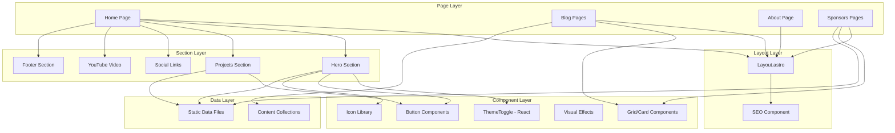

# Project Architecture

This document provides an overview of the project's architecture to facilitate understanding and future development.

## Overview

**gohit.xyz** is a modern portfolio website built with **Astro 5**, featuring a blog system, interactive components, and optimized performance. The project leverages Astro's hybrid static/dynamic rendering capabilities, React for interactive elements, and Tailwind CSS v4 for styling.

## Technology Stack

- **Framework**: Astro 5.15.6
- **UI Libraries**: React 19.2.0 (for interactive components)
- **Styling**: Tailwind CSS 4.1.17 + Custom CSS
- **Content**: MDX for blog articles with content collections
- **Integrations**:
  - `@astrojs/react`: React component support
  - `@astrojs/mdx`: MDX content processing
  - `@astrojs/sitemap`: Automatic sitemap generation
- **Runtime**: Bun (development server)
- **Deployment**: Vercel (configured for SSR/SSG hybrid)

## Directory Structure

```
src/
├── assets/          # Static assets (images, SVGs)
├── components/      # Reusable UI components
│   ├── SEO.astro    # SEO meta tags component
│   ├── ThemeToggle.tsx  # React-based theme switcher
│   ├── icons/       # SVG icon components (37 icons)
│   └── ui/          # UI component library
│       ├── buttons/ # Button components (7 variants)
│       ├── effects/ # Visual effects (8 components)
│       ├── grids/   # Card/grid layouts (4 components)
│       └── ui.ts    # Barrel export file
├── content/         # Content collections
│   ├── articles/    # Blog articles (MDX)
│   └── config.ts    # Content schema definitions
├── data/            # Static data (TypeScript)
│   ├── extensions.ts
│   ├── linux.ts
│   ├── sponsors.ts
│   ├── x.ts
│   └── youtube.ts
├── layouts/         # Page layouts
│   └── Layout.astro # Main layout with SEO, theme, view transitions
├── pages/           # File-based routing
│   ├── index.astro  # Home page
│   ├── 404.astro    # Error page
│   ├── blog/        # Blog routes
│   │   ├── index.astro       # Blog listing with pagination
│   │   └── [slug].astro      # Dynamic article pages
│   ├── me/          # About page
│   ├── new/         # New content/projects
│   └── sponsors/    # Sponsorship pages
├── sections/        # Page sections (high-level blocks)
│   ├── home/        # Home page sections
│   │   ├── Hero.astro
│   │   ├── Projects.astro
│   │   ├── SocialLinks.astro
│   │   └── YouTubeVideo.astro
│   ├── shared/      # Shared sections
│   │   └── Footer.astro
│   └── sections.ts  # Barrel export file
└── styles/          # Global stylesheets
    └── global.css   # Theme variables, base styles
```

## Component Architecture

### Component Hierarchy



### Component Organization

#### UI Components (`src/components/ui/`)

**Buttons** (7 components):

- `BackButtonOne.astro`: History-based navigation
- `BackButtonTwo.astro`: URL-based navigation with optional history mode
- `CircleButtonUp.astro`: Scroll-to-top button
- `GithubStartBtn.astro`: GitHub repository star button
- `LinuxBtn.astro`: Custom Linux-themed button with animations
- `NextPageBtn.astro`: Blog pagination
- `YoutubeBtn.astro`: YouTube channel link

**Grids** (4 components):

- `BlogArticlesCard.astro`: Blog article cards with metadata
- `ExtensionBtns.astro`: Extension/project grid
- `SponsorCard.astro`: Sponsor information cards
- `SponsorXBtns.astro`: Interactive sponsor platform buttons

**Effects** (8 components):
Visual effects and animations for enhanced UI

**Icons** (37 components):
SVG-based icon library for consistent iconography

## Content Collections

### Blog System

The blog uses Astro's Content Collections API for type-safe content management:

**Schema** (`src/content/config.ts`):

```typescript
{
  title: string
  description: string
  publishDate: date | string
  author?: string
  image?: string
  banner?: string
  profile?: string
  tags?: string[]
  draft?: boolean
  url?: string
}
```

**Features**:

- Dynamic routing with `[slug].astro`
- Pagination support
- Tag/category filtering
- Reading time calculation
- Related articles
- Search functionality
- Draft mode

## Key Architectural Patterns

### 1. Barrel Exports

Clean imports using aggregator files:

- `src/sections/sections.ts`: All sections
- `src/components/ui/ui.ts`: All UI components

```typescript
// Instead of:
import Hero from '@/sections/home/Hero.astro'
import Projects from '@/sections/home/Projects.astro'

// Use:
import { Hero, Projects } from '@/sections/sections'
```

### 2. Separation of Concerns

| Layer          | Responsibility                 | Example                                |
| -------------- | ------------------------------ | -------------------------------------- |
| **Pages**      | Routing & composition          | `pages/index.astro`                    |
| **Layouts**    | Shell structure, SEO, theme    | `layouts/Layout.astro`                 |
| **Sections**   | High-level content blocks      | `sections/home/Hero.astro`             |
| **Components** | Reusable UI elements           | `components/ui/buttons/LinuxBtn.astro` |
| **Data**       | Static content & configuration | `data/sponsors.ts`                     |
| **Content**    | Blog articles & collections    | `content/articles/`                    |

### 3. Hybrid Rendering

- **Static**: Most pages (SSG for performance)
- **Interactive**: React components with `client:idle` directive
- **Dynamic**: Blog pagination and filtering

### 4. Theme System

- CSS custom properties in `global.css`
- React-based toggle for client-side switching
- Persistent storage using localStorage
- Dark/light mode support across all components

### 5. Performance Optimizations

- View transitions for smooth navigation
- Image optimization (WebP format)
- Lazy loading for interactive components
- Minimal JavaScript footprint
- Responsive images with proper sizing

## SEO Architecture

The `SEO.astro` component provides:

- Dynamic meta tags
- Open Graph protocol support
- Twitter Card metadata
- Canonical URLs
- Structured data
- Sitemap generation (via integration)

## Responsive Design

Mobile-first approach with breakpoints:

- Custom responsive grids for sponsors page
- Adaptive layouts for blog cards
- Mobile-optimized navigation
- Touch-friendly interactive elements

## Future Refactoring Recommendations

### Short-term

- [ ] Extract common button patterns into a base component
- [ ] Implement component-level CSS modules for better encapsulation
- [ ] Add TypeScript types for all data files
- [ ] Create shared types for SEO metadata

### Medium-term

- [ ] Implement view transition API for smoother page changes
- [ ] Add internationalization (i18n) support
- [ ] Create design system documentation
- [ ] Implement automated testing for critical components

### Long-term

- [ ] Consider component library extraction for reusability
- [ ] Evaluate CDN strategies for images
- [ ] Implement advanced analytics integration
- [ ] Add CMS integration for non-technical content updates

## Development Workflow

```bash
# Development
bun dev          # Start dev server

# Build
bun run build    # Production build
bun run preview  # Preview production build

# Code quality
bun run check    # Type checking
bun run format   # Prettier formatting
```

## Deployment

- **Platform**: Vercel
- **Build command**: `bun run build`
- **Output directory**: `dist/`
- **Node version**: 18+
- **Site URL**: https://www.gohit.xyz

---

**Last Updated**: Decenber 8, 2025  
**Astro Version**: 5.15.6  
**Maintainer**: Gohit X
