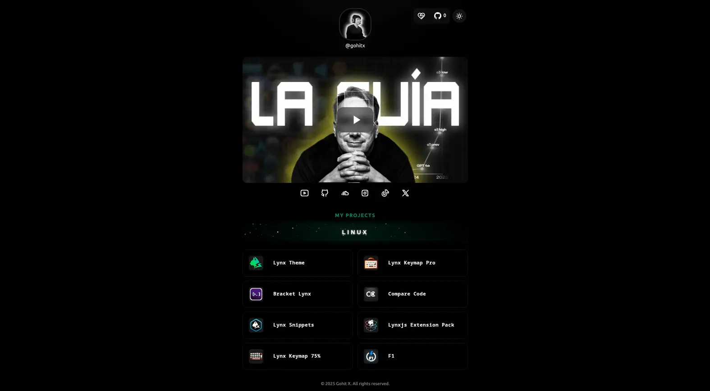
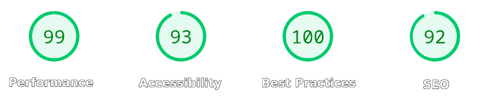

<div align="center" id="readme-top">

# gohit.xyz

**Modern Portfolio & Blog** — Built with Astro 5, React & Tailwind CSS

[](https://astro.build)
[](https://react.dev)
[](https://tailwindcss.com)
[](https://bun.sh)

[**Architecture**](./ARCHITECTURE.md)

---



<br />



</div>

<br>

## 🛠️ Tech Stack

| Category         | Technologies                     |
| ---------------- | -------------------------------- |
| **Framework**    | Astro 5.16.4                     |
| **UI Libraries** | React 19.2.1                     |
| **Styling**      | Tailwind CSS 4.1.17 + Custom CSS |
| **Runtime**      | Bun                              |
| **Dev Tools**    | Prettier + TypeScript            |

---

## 📁 Project Structure

```
src/
├── assets/          # Static assets (images, SVGs)
├── components/      # Reusable UI components
│   ├── icons/       # SVG icon library
│   │   ├── global/           # General icons
│   │   └── social-media/     # Social platform icons
│   ├── me/          # About page components + i18n
│   │   ├── LanguageSelector.astro
│   │   ├── MePageTemplate.astro
│   │   ├── MePicture.astro
│   │   └── i18n/             # Translations (en, es, zh)
│   └── ui/          # UI components
│       ├── buttons/          # Interactive buttons
│       └── effects/          # Visual effects
├── config/          # Configuration files
│   └── seoConfig.ts # SEO settings
├── data/            # Static data files (TypeScript)
│   ├── extensions.ts # VSCode extensions showcase
│   └── youtube.ts    # YouTube channel data
├── layouts/         # Page layouts with SEO & theme
│   └── Layout.astro  # Main layout wrapper
├── pages/           # File-based routing
│   ├── index.astro   # Home page
│   ├── 404.astro     # Error page
│   └── me/           # About pages with i18n
│       ├── index.astro        # English
│       ├── es/index.astro     # Spanish
│       └── zh/index.astro     # Chinese
├── sections/        # High-level page sections
│   ├── home/        # Home page sections
│   └── shared/      # Shared components
└── styles/          # Global CSS with theme variables
    └── global.css
```

> 📖 For detailed architecture documentation, see [ARCHITECTURE.md](./ARCHITECTURE.md)

---

## 🚀 Getting Started

### Prerequisites

- **Bun** runtime installed ([install guide](https://bun.sh))
- Node 18+ compatible environment

### Installation

```bash
# Clone the repository
git clone https://github.com/gohit-xyz/gohit.xyz.git
cd gohitx

# Install dependencies
bun install
```

### Development

```bash
# Start development server
bun dev

# Build for production
bun run build

# Preview production build
bun run preview
```

---

## ✨ Key Features

- 🎨 **Modern UI/UX** - Clean design with smooth animations
- 🌙 **Dark/Light Mode** - System preference + manual toggle
- 🌍 **Internationalization** - Multi-language support (EN/ES/ZH)
- ⚡ **High Performance** - Optimized with Astro's zero-JS approach
- 📱 **Fully Responsive** - Mobile-first design
- 🔍 **SEO Optimized** - Rich meta tags & structured data

## �️ Adding Integrations

### Tailwind CSS

```bash
bunx astro add tailwindcss
```

### React

```bash
bunx astro add react
```

### Prettier

```bash
bun add -d prettier prettier-plugin-astro prettier-plugin-tailwindcss
```

---

<div align="center">

**Built with 🧡 by @gohitx**

</div>

<p align="right">
    (<strong><a href="#readme-top">Back to Top</a></strong>)
</p>
